# G H Patel College of Engineering and Technology
## (A Constituent College of CVM University), Vallabh Vidyanagar
## Information Technology Department

\newpage

# Mini Project Report
## AI Powered Online Exam Proctoring System

### Submitted By
- Patel Tirth (12302080501061)
- Gorasiya Yajush (12302080501066)

### Guided By
- Dr. Jay Vala

### Course
- MINI PROJECT (202040601)

### Academic Year
- 2025-26 (Even Term)

\newpage

# Certificate

This is to certify that the mini project report entitled **"AI Powered Online Exam Proctoring System"** has been carried out by:

- Patel Tirth (12302080501061)
- Gorasiya Yajush (12302080501066)

under the guidance of Dr. Jay Vala in partial fulfillment of the requirements for the degree of Bachelor of Engineering in Information Technology, G H Patel College of Engineering and Technology, CVM University, Vallabh Vidyanagar, during academic year 2025-26.

Guide Signature: ____________________

Head of Department Signature: ____________________

\newpage

# Declaration

We hereby declare that the work presented in this report is our original work carried out under the supervision of the project guide. Any sources used have been acknowledged in the references section.

Student 1 Signature: ____________________

Student 2 Signature: ____________________

\newpage

# Acknowledgement

We express our sincere gratitude to everyone who supported us in completing this mini project on **AI Powered Online Exam Proctoring System**.

We are deeply thankful to our project guide, **Dr. Jay Vala**, for continuous mentorship, technical direction, and constructive reviews during all phases of design, implementation, testing, and documentation.

We thank **Prof. Nikhil Gondaliya, Head of the Information Technology Department**, and all faculty members for providing a strong academic environment, infrastructure support, and timely guidance.

We also thank our peers for practical discussions, testing support, and feedback that helped improve system quality and usability.

Finally, we thank our families for their encouragement and patience throughout this project.

\newpage

# Abstract

Online examinations have become mainstream in higher education, but the quality of remote invigilation remains a major challenge. Traditional remote supervision is costly, difficult to scale, and often inconsistent. This project presents a full-stack **AI powered online exam proctoring platform** designed to provide automated integrity monitoring in real time while keeping the exam workflow practical for students, examiners, and administrators.

The implemented system combines three coordinated layers:

- A **student-facing web frontend** built with React and TypeScript for exam delivery, pre-exam checks, and live warning overlays.
- A **Node.js and Express backend** for authentication, exam/session management, violation persistence, reporting, and role-based access control.
- A **Python FastAPI AI service** using MediaPipe and YOLO-based detection for face visibility, gaze/head behavior analysis, and prohibited object detection.

The pre-exam process verifies webcam readiness, internet status, AI service health, and face visibility. It also performs a short gaze calibration step to improve user-specific tracking stability. During exams, the client captures frames at adaptive intervals and sends them to backend proctoring routes, which securely proxy requests to the Python service and persist validated violations. The system supports role-based dashboards for student, examiner, and admin users, including live monitoring indicators and post-exam integrity analysis.

A practical risk strategy is implemented through:

- Rule-based suspicion scoring with decay/recovery.
- Threshold-based violation typing (no face, multiple faces, prohibited object, high suspicion).
- Cooldown-based deduplication to reduce duplicate alerts.
- Auto-submit trigger when serious violations accumulate.

The project also includes an optional **shadow machine learning model** pipeline that can be trained from logs (`exam_log.csv`) and used for non-blocking comparative inference (`ml_shadow`) without changing current production decision flow.

This report documents problem context, requirement analysis, architecture, module design, algorithms, API design, implementation details, testing strategy, results, limitations, ethics, and future roadmap. The report also includes detailed UML and DFD diagrams (with PlantUML code) so document conversion and visual generation can be done reproducibly.

**Keywords:** Online Proctoring, AI, Computer Vision, MediaPipe, YOLO, FastAPI, Express, React, Academic Integrity, Violation Analytics

\newpage

# Table of Contents

- [1 Introduction](#1-introduction)
  - [1.1 Problem Statement](#11-problem-statement)
  - [1.2 Project Overview](#12-project-overview)
  - [1.3 Aim and Objectives](#13-aim-and-objectives)
  - [1.4 Scope and Boundaries](#14-scope-and-boundaries)
  - [1.5 Contributions](#15-contributions)
- [2 System Analysis](#2-system-analysis)
  - [2.1 Motivation](#21-motivation)
  - [2.2 Literature and Existing Systems Review](#22-literature-and-existing-systems-review)
  - [2.3 Gap Analysis](#23-gap-analysis)
  - [2.4 Feasibility Analysis](#24-feasibility-analysis)
- [3 Design Analysis and Methodology](#3-design-analysis-and-methodology)
  - [3.1 Requirement Analysis](#31-requirement-analysis)
  - [3.2 Technology Stack and Environment](#32-technology-stack-and-environment)
  - [3.3 System Architecture](#33-system-architecture)
  - [3.4 Module Specifications](#34-module-specifications)
  - [3.5 Data Model Design](#35-data-model-design)
  - [3.6 Proctoring Algorithms and Thresholds](#36-proctoring-algorithms-and-thresholds)
  - [3.7 Timeline Plan](#37-timeline-plan)
  - [3.8 UML and DFD Diagrams](#38-uml-and-dfd-diagrams)
- [4 Implementation and Results](#4-implementation-and-results)
  - [4.1 End-to-End System Flow](#41-end-to-end-system-flow)
  - [4.2 Frontend Implementation](#42-frontend-implementation)
  - [4.3 Backend Implementation](#43-backend-implementation)
  - [4.4 AI Service Implementation](#44-ai-service-implementation)
  - [4.5 Security and Reliability Controls](#45-security-and-reliability-controls)
  - [4.6 Testing Strategy](#46-testing-strategy)
  - [4.7 Observed Results and Discussion](#47-observed-results-and-discussion)
  - [4.8 Screenshots Section (Placeholders)](#48-screenshots-section-placeholders)
- [5 Conclusion and Future Work](#5-conclusion-and-future-work)
  - [5.1 Conclusion](#51-conclusion)
  - [5.2 Limitations](#52-limitations)
  - [5.3 Future Enhancements](#53-future-enhancements)
- [Appendix A: API Summary](#appendix-a-api-summary)
- [Appendix B: PlantUML Diagram Source Blocks](#appendix-b-plantuml-diagram-source-blocks)
- [Appendix C: Build and Conversion Steps](#appendix-c-build-and-conversion-steps)
- [References](#references)

\newpage

# List of Figures

- Figure 1: High Level System Architecture
- Figure 2: Use Case Diagram
- Figure 3: Class Diagram
- Figure 4: Sequence Diagram - Exam Session Flow
- Figure 5: DFD Level 0 (Context)
- Figure 6: DFD Level 1
- Figure 7: ER Diagram (MongoDB Collections)
- Figure 8: Deployment Diagram
- Figure 9: Activity Diagram - Pre-Exam and Calibration
- Figure 10: State Diagram - Submission Control State

# List of Tables

- Table 1: Functional Requirements
- Table 2: Non-Functional Requirements
- Table 3: Hardware and Software Requirements
- Table 4: Module Specification Matrix
- Table 5: API Endpoint Summary
- Table 6: Test Case Matrix
- Table 7: Risk Classification Mapping
- Table 8: Timeline Plan (15 Weeks)

\newpage

# 1 Introduction

## 1.1 Problem Statement

Remote assessments are now part of regular academic workflows. However, the trust model of online exams is weak when:

- The candidate identity is not continuously validated.
- Browser behavior is not monitored.
- Visual cheating indicators are not captured or audited.
- Manual invigilation is limited due to budget and scale constraints.

The absence of reliable proctoring leads to fairness issues for honest students and weakens institutional confidence in online assessment quality. A practical system is required that can run with standard webcams and browsers while producing actionable evidence for examiners.

## 1.2 Project Overview

This project implements an integrated **AI online proctoring platform** with three coordinated services:

- **Frontend (`frontend/`)**: React + Vite + TypeScript application for exam UI, pre-checks, overlays, warnings, and dashboards.
- **Backend (`backend/`)**: Express + MongoDB + Socket.IO server for auth, exam lifecycle, violation logging, live monitoring support, and reports.
- **AI Service (`AI_PROCTORING/`)**: FastAPI + MediaPipe + OpenCV + YOLO service for frame-level proctoring analysis.

Core proctoring capabilities:

- Face detection and face count.
- Gaze direction (including vertical component), head pose estimation (yaw and pitch), and suspicion scoring.
- Prohibited object detection using YOLO.
- Violation typing and risk-level estimation.
- Real-time frontend overlays and warning support.
- Session persistence and examiner review data.

## 1.3 Aim and Objectives

### Aim

To design and implement a scalable, modular, and practical AI-assisted online examination proctoring solution that improves exam integrity in real-world conditions.

### Objectives

1. Build secure authentication and role-based workflows for student, examiner, and admin.
2. Implement real-time webcam proctoring analysis via Python CV service.
3. Integrate browser security controls for tab switch/fullscreen/clipboard violations.
4. Provide low-latency overlays and robust queue/retry behavior for unstable networks.
5. Persist violations with evidence and expose examiner/admin monitoring and report views.
6. Add calibration to improve user-specific gaze/head baseline stability.
7. Support optional shadow ML scoring without replacing current rule-based decisions.

## 1.4 Scope and Boundaries

### In Scope

- Desktop browser-based online exam workflow.
- AI-assisted proctoring using camera frames.
- Rule-based suspicion and violation pipeline.
- Evidence-oriented reporting and monitoring dashboards.

### Out of Scope (Current Version)

- Audio analysis and speech keyword detection.
- Mobile native proctoring apps.
- Full anti-spoofing biometric identity re-verification at runtime.
- Production-grade distributed deployment automation (Kubernetes level).

## 1.5 Contributions

Key engineering contributions of this project include:

- Hybrid, queue-based frame transport from browser to backend.
- Proctoring route hardening with auth + route-specific rate limits.
- Session-aware calibration pipeline before exam start.
- Multi-signal violation handling and cooldown-based deduplication.
- Real-time overlays showing practical debugging and proctoring values.
- Optional shadow ML model for offline comparison and future transition study.

\newpage

# 2 System Analysis

## 2.1 Motivation

Main drivers for this project:

- Increased online assessments and reduced trust in honor-based systems.
- Need for objective and auditable integrity signals beyond manual observation.
- Cost and scalability limitations of fully human proctoring.
- Availability of mature open-source CV tooling (MediaPipe, OpenCV, YOLO, FastAPI).

Institutional deployment constraints were considered early:

- Students have heterogeneous hardware and network quality.
- Low-friction setup is necessary for exam acceptance.
- False positives must be minimized to avoid unnecessary candidate stress.
- Recorded evidence must be reviewable and linked to timestamped violations.

## 2.2 Literature and Existing Systems Review

Existing approaches can be categorized as:

1. Manual remote proctoring.
2. Browser lockdown without camera analytics.
3. AI-only camera analytics.
4. Hybrid models combining browser + CV + human review.

Commercial tools often provide full monitoring but may have:

- High per-session costs.
- Limited transparency of scoring logic.
- Integration complexity for custom academic workflows.

Academic prototypes often demonstrate one signal (for example gaze only), while real deployments need coordinated handling of:

- Face absence.
- Multi-face presence.
- Object detection.
- Browser behavior.
- Session state transitions.

Our architecture aims for this coordinated coverage while keeping components replaceable.

## 2.3 Gap Analysis

### Observed Gaps in Typical Solutions

- Single-signal detection leads to either missed cheating or high false positives.
- Non-resilient frame transport fails during transient network issues.
- Weak traceability between alert generation and persisted exam records.
- Poor role separation for student, examiner, and admin workflows.

### How This Project Addresses Gaps

- Combines behavioral CV + object detection + browser event monitoring.
- Implements queue + retry + adaptive pacing in frame sender.
- Logs violations to submission records with timestamps and evidence.
- Uses role-protected APIs and dashboard-specific endpoints.

## 2.4 Feasibility Analysis

### Technical Feasibility

The selected stack is proven and compatible:

- React + Vite for responsive UI updates.
- Express for API routing and session logic.
- FastAPI for CV inference endpoints.
- MongoDB for flexible and nested violation records.

### Operational Feasibility

- Runs on commodity webcam hardware.
- Supports local LAN/dev deployment with low setup overhead.
- Can be upgraded incrementally due to modular service boundaries.

### Economic Feasibility

- Relies primarily on open-source software.
- Avoids third-party per-exam licensing in core architecture.
- Allows institution-controlled hosting and data retention.

\newpage

# 3 Design Analysis and Methodology

## 3.1 Requirement Analysis

### Functional Requirements

| ID | Requirement | Priority |
|---|---|---|
| FR1 | User registration and login with role awareness | High |
| FR2 | Start/resume exam session and maintain status | High |
| FR3 | Perform pre-exam webcam and AI service checks | High |
| FR4 | Capture and analyze webcam frames in near real time | High |
| FR5 | Detect no-face, multi-face, high suspicion, prohibited objects | High |
| FR6 | Persist violations with severity and evidence | High |
| FR7 | Show live proctoring overlays and warnings in student view | Medium |
| FR8 | Examiner monitoring and integrity report generation | High |
| FR9 | Admin dashboards and user controls (suspend/unsuspend) | Medium |
| FR10 | Support optional ML shadow inference from exam logs | Low/Experimental |

### Non-Functional Requirements

| ID | Requirement | Target |
|---|---|---|
| NFR1 | Reliability under intermittent network | Queue + retry + adaptive pacing |
| NFR2 | Security for proctoring routes | Auth middleware + rate limiting |
| NFR3 | Latency for overlay updates | Fast tracking loop (~120 ms in active exam config) |
| NFR4 | Maintainability | Modular frontend/backend/AI folders |
| NFR5 | Observability | Health endpoints, logs, violation records |
| NFR6 | Scalability baseline | Sessionized processing and route-level controls |

## 3.2 Technology Stack and Environment

### Frontend

- React 18 + TypeScript + Vite
- UI libraries: Radix components, Lucide icons
- MediaPipe Tasks Vision (`@mediapipe/tasks-vision`) support in local tracking hooks

### Backend

- Node.js + Express
- MongoDB + Mongoose
- Socket.IO for monitoring events
- JWT auth with access/refresh token flow

### AI Service

- Python FastAPI + Uvicorn
- OpenCV, NumPy, MediaPipe
- Ultralytics YOLO (uses `yolov8s.pt`/`yolov8n.pt`)
- Optional: pandas, scikit-learn, joblib for shadow model

### Hardware and Software Requirements

| Category | Minimum | Recommended |
|---|---|---|
| CPU | Dual core | Quad core+ |
| RAM | 4 GB | 8 GB+ |
| Webcam | 720p | 1080p |
| Browser | Chrome/Edge/Firefox modern versions | Latest stable |
| Internet | 2 Mbps | 10 Mbps+ |
| Python | 3.9+ | 3.10+ |
| Node.js | 18+ | 20+ |

## 3.3 System Architecture

The architecture follows a service-separated pattern:

1. Browser app manages UI, exam workflow, and frame capture.
2. Node backend authenticates users, validates exam sessions, proxies frame requests, and persists violations.
3. Python AI service performs frame analysis and returns structured proctoring signals.

### Figure 1: High Level System Architecture (PlantUML)

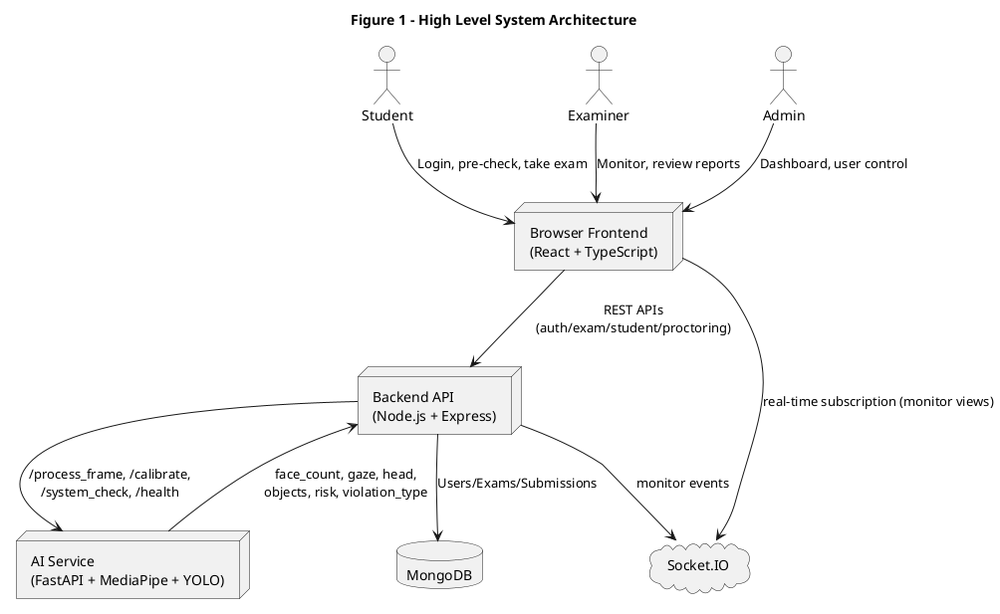

## 3.4 Module Specifications

| Module | Key Responsibilities | Inputs | Outputs |
|---|---|---|---|
| Authentication | Register/login/logout/refresh, role protection | Credentials, JWT | Authenticated sessions |
| Exam Management | Create/update/list exams, schedule, question sets | Exam metadata | Exam documents |
| Student Session | Start/resume/heartbeat/submit | ExamId, answers | Session state, score |
| Browser Security | Detect fullscreen exit/tab changes/copy-paste | DOM events | Violation events |
| Proctoring Transport | Capture, queue, retry, adaptive send | Webcam frames | AI analysis response |
| AI Analyzer | Holistic gaze/head + object detection + risk signals | JPEG frame | Structured proctoring metrics |
| Examiner Monitoring | Risk queues, submission actions, integrity reports | Submission + violation history | Report data and intervention actions |
| Admin Operations | Global metrics, active sessions, user controls | Organization-wide data | Dashboard and management actions |

## 3.5 Data Model Design

Main MongoDB collections:

- `users`
- `exams`
- `submissions`
- `tokenblacklists`

### Core Relations

- One `User` (examiner) can create many `Exam`.
- One `User` (student) can have many `Submission`.
- One `Submission` belongs to one `Exam`.
- One `Submission` contains many `violations`.

### Figure 7: ER Diagram (PlantUML)

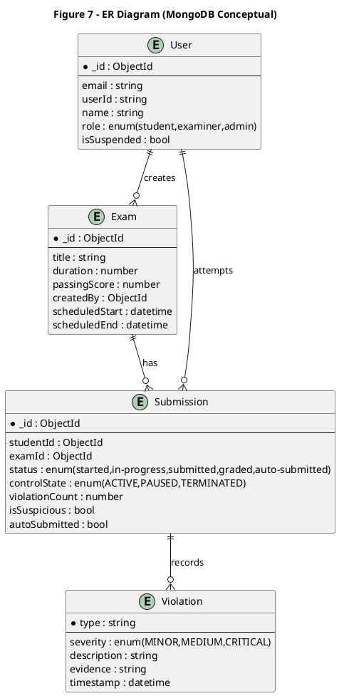

## 3.6 Proctoring Algorithms and Thresholds

### 3.6.1 Frame Transport Strategy

The `useProctoring` hook uses:

- Fast tracking mode for frequent gaze/head updates.
- Lower-frequency object detection mode.
- Queue size control (`maxQueuedFrames` default 1 in current use).
- Retry/backoff for retriable HTTP failures (500, 429, 408).

Current practical values from active exam integration:

- Tracking interval: `120 ms` (configured in `ActiveExam.tsx`).
- Object detection interval: `2000 ms`.
- Tracking frame size: `432 x 324`, JPEG quality ~`0.6`.
- Object frame size: `480 x 360`, JPEG quality ~`0.7`.

### 3.6.2 Face Detection

The AI service quickly estimates face count using MediaPipe face detection with confidence and area filtering.

Design intent:

- Reject tiny false detections.
- Return stable count for no-face and multi-face logic.

### 3.6.3 Holistic Gaze and Head Estimation

`HolisticDetector` computes:

- Horizontal gaze ratio.
- Vertical gaze ratio.
- Head yaw and pitch (bias-corrected and smoothed).
- Direction labels with hysteresis.

Example threshold behavior implemented:

- Horizontal entry around `<0.45` (left) and `>0.55` (right).
- Vertical conservative entry around `<0.34` (up) and `>0.66` (down).
- Pitch-based suppression is used to reduce false vertical gaze triggers.

### 3.6.4 Suspicion Score

`BehaviorAnalyzer` updates a score in `[0, 100]`:

- Increases on sustained abnormal behavior (streak-based).
- Decays when behavior returns to normal.
- Additional penalties for object detection and multi-face conditions.

This yields an adaptive score rather than a one-frame decision.

### 3.6.5 Risk and Violation Mapping

Risk mapping in AI service:

- `HIGH`: multiple faces, prohibited objects, or high score.
- `MEDIUM`: moderate score.
- `LOW`: otherwise.

Violation typing includes:

- `PROHIBITED_OBJECT`
- `MULTIPLE_FACES`
- `NO_FACE`
- `HIGH_SUSPICION`

Cooldown controls prevent repetitive duplicate violation logging.

### 3.6.6 Calibration Method

Pre-exam calibration captures multiple centered-view frames and computes median baselines for:

- `gaze_h_baseline`
- `gaze_v_baseline`
- `head_yaw_baseline`
- `head_pitch_baseline`

Calibration is validated and rejected when user posture/gaze is too far from center.

## 3.7 Timeline Plan

### Table 8: Suggested 15-Week Timeline

| Week Range | Phase | Deliverables |
|---|---|---|
| 1-2 | Requirement and planning | SRS draft, architecture baseline |
| 3-4 | Frontend exam flow | Login, role routing, exam pages |
| 5-6 | Backend core APIs | Auth, exam CRUD, student session routes |
| 7-8 | AI service integration | Frame processing endpoints, health checks |
| 9-10 | Proctoring logic tuning | Thresholds, overlays, cooldown controls |
| 11-12 | Monitoring and reports | Examiner/admin dashboards, integrity reports |
| 13 | Reliability and security hardening | CORS, rate limits, route auth |
| 14 | Testing and bug fixes | Integration testing, issue closure |
| 15 | Documentation and final review | Report, diagrams, demo preparation |

### Gantt-Style Timeline (PlantUML)

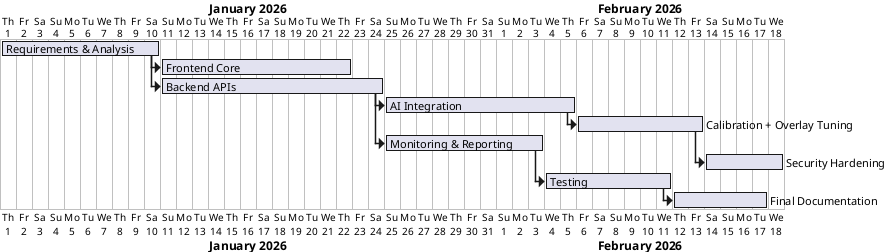

## 3.8 UML and DFD Diagrams

### Figure 2: Use Case Diagram (PlantUML)

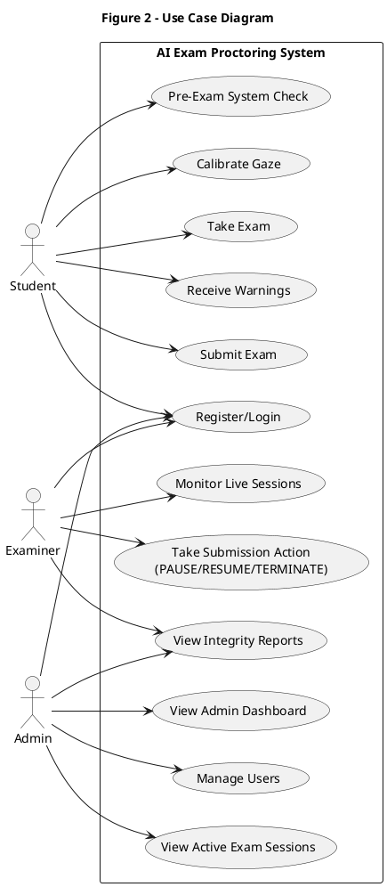

### Figure 3: Class Diagram (PlantUML)

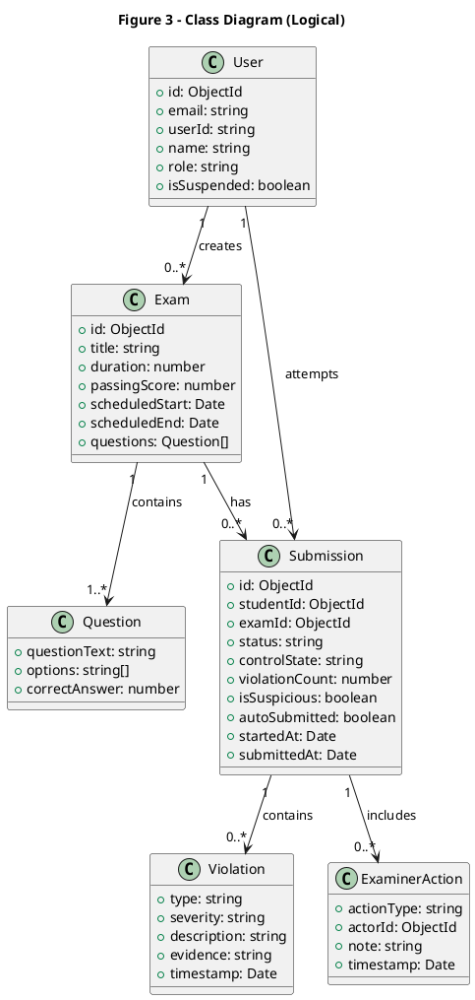

### Figure 4: Sequence Diagram - Exam Session Flow (PlantUML)

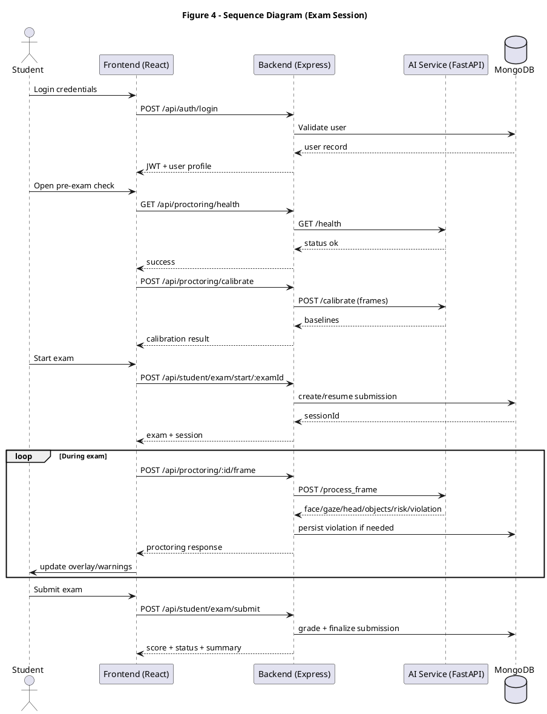

### Figure 5: DFD Level 0 (Context) - PlantUML

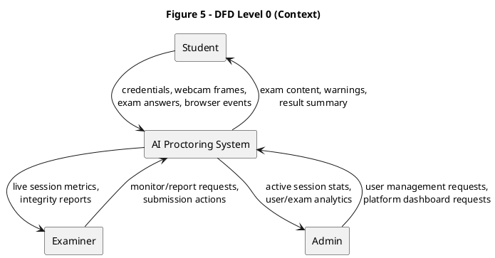

### Figure 6: DFD Level 1 - PlantUML

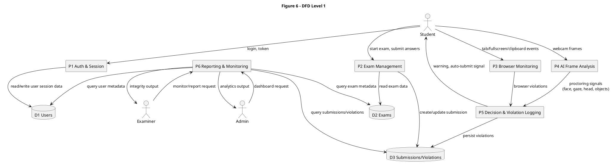

\newpage

# 4 Implementation and Results

## 4.1 End-to-End System Flow

### Stage 1: Authentication and Route Access

- Users login via `/api/auth/login`.
- Backend issues access token (and refresh mechanism support exists).
- Frontend stores token and attaches `Authorization: Bearer <token>` for protected APIs.

### Stage 2: Pre-Exam Validation

From `PreExamCheck.tsx` and `WebcamPreview.tsx`:

1. Webcam readiness is validated.
2. Face presence is checked via `/api/proctoring/system-check/frame`.
3. Internet and AI service health are checked.
4. Calibration (5-second capture) computes gaze/head baselines.

### Stage 3: Session Start

- Student starts exam using `/api/student/exam/start/:examId`.
- Existing active sessions are resumed if found.
- Session state includes `controlState`, pause metadata, and violation counters.

### Stage 4: Runtime Monitoring

During active exam:

- Frontend uses `useProctoring` for frequent tracking/object frame dispatch.
- Backend `/api/proctoring/:id/frame` is auth-protected and rate-limited.
- Backend proxies frame to Python `/process_frame` with retry strategy.
- Python returns metrics + risk + violation info.
- Backend can persist validated AI violations into submission records.

### Stage 5: Response and Enforcement

- Frontend updates overlays (risk level, gaze/head, faces, vertical gaze value).
- Warnings are shown based on violation events.
- Auto-submit condition is triggered around violation threshold (`>=3`).

### Stage 6: Submission and Reporting

- Student submits answers.
- Backend grades and stores results.
- Examiner and admin dashboards read violation-rich submission history.

## 4.2 Frontend Implementation

### 4.2.1 Route and Role Structure

Frontend route wrappers:

- `ProtectedRoute`
- `StudentRoute`
- `ExaminerRoute`
- `AdminRoute`

Pages include:

- Login/Signup
- Student dashboard, pre-check, active exam
- Examiner dashboard/monitor/reports
- Admin dashboard/monitor/users

### 4.2.2 Active Exam Overlay Behavior

The exam video panel shows:

- Live proctoring status.
- Risk level badge (`LOW`, `MEDIUM`, `HIGH`).
- Gaze direction and head pose.
- Face count.
- Numeric `Pitch`, `Yaw`, and `Gaze Vertical` values.
- Suspicion score bar.

The camera display is mirrored in UI (`scaleX(-1)`), matching user expectations for webcam previews.

### 4.2.3 Queue, Retry, and Adaptive Send

Design details from `useProctoring.ts`:

- Frame queue with bounded length.
- Retries for retriable failures (including HTTP `429`).
- Adaptive pacing based on RTT and consecutive failures.
- AI service availability indicator if repeated send failures occur.

This design reduces stale overlay updates and provides smoother real-time behavior.

## 4.3 Backend Implementation

### 4.3.1 API Layer

Backend route groups:

- `/api/auth`
- `/api/exam`
- `/api/student`
- `/api/examiner`
- `/api/admin`
- `/api/proctoring`

### 4.3.2 Proctoring Route Controls

`/api/proctoring/:id/frame` includes:

- Auth protection (`protect` middleware).
- Dedicated rate limiter (`PROCTORING_FRAME_LIMIT_PER_MIN`, default 1200/min).
- Per-user and per-exam keying for fair throttling.

### 4.3.3 Violation Persistence Strategy

Backend normalizes AI response and can persist AI violations into `Submission.violations` when:

- Session is valid and active.
- Violation type is present and eligible.
- Cooldown logic permits persistence.

Recorded fields include type, severity, description, evidence, timestamp.

### 4.3.4 Examiner and Admin Features

- Examiner monitor endpoint calculates risk score and queue ordering.
- Submission action endpoint supports `PAUSE`, `RESUME`, `TERMINATE`, `MARK_FALSE_POSITIVE`.
- Admin dashboard aggregates totals, active sessions, and recent violations.

## 4.4 AI Service Implementation

### 4.4.1 FastAPI Endpoints

Implemented endpoints:

- `GET /health`
- `POST /system_check`
- `POST /calibrate`
- `POST /process_frame`
- `POST /reset_session`

### 4.4.2 Sessionized Processing

Per-session state stores:

- `HolisticDetector` instance.
- `BehaviorAnalyzer` instance.
- Violation cooldown metadata.
- Baseline calibration application state.

Stale sessions are cleaned with TTL logic.

### 4.4.3 Holistic + Object Pipeline

`/process_frame` flow:

1. Decode frame.
2. Face count estimate.
3. Optional object-only mode.
4. Holistic analysis for gaze/head/body/hands.
5. Suspicion scoring.
6. Risk and violation type mapping.
7. Optional image annotation + return payload.

### 4.4.4 Optional ML Shadow Mode

If enabled via environment variable (`AI_ML_SHADOW_ENABLED=1`) and `model.pkl` is available:

- AI service computes `ml_shadow` prediction.
- Output is informational and does not alter current core violation decisions.

This allows safe comparison between rule-based and model-based scoring.

## 4.5 Security and Reliability Controls

### Security Controls

- JWT-based auth middleware.
- Route-level role controls.
- CORS handling and preflight support.
- Global and route-specific rate limiting.
- Token blacklist support on logout.
- Password hashing with bcrypt.

### Reliability Controls

- Backend retry to AI service for non-realtime calls.
- Frontend queue/retry and adaptive pacing.
- AI health endpoint and pre-exam service check.
- Session resume support in exam start flow.
- Heartbeat endpoint for session liveness.

## 4.6 Testing Strategy

Testing included:

- API behavior checks.
- Proctoring flow tests (manual + integrated runs).
- Session lifecycle and auto-submit behavior.
- Dashboard and report data validation.

### Table 6: Test Case Matrix

| No | Test Case | Input Scenario | Expected Output | Status |
|---|---|---|---|---|
| 1 | Valid login | Correct email/password | Access granted | Pass |
| 2 | Invalid login | Wrong password | 401 + error message | Pass |
| 3 | System check face | User in frame | face_count > 0 | Pass |
| 4 | Calibration success | User centered for 5s | baselines generated | Pass |
| 5 | Calibration fail | User looking away | validation error message | Pass |
| 6 | Frame auth guard | Missing token | 401 unauthorized | Pass |
| 7 | Frame rate limit | Excessive frame burst | 429 too many requests | Pass |
| 8 | Prohibited object | Phone visible | violation_type = PROHIBITED_OBJECT | Pass |
| 9 | No face | User absent from frame | violation_type = NO_FACE | Pass |
| 10 | Multi face | Two faces in frame | violation_type = MULTIPLE_FACES | Pass |
| 11 | Violation persistence | repeated valid violations | violationCount increments | Pass |
| 12 | Auto submit threshold | violationCount >= 3 | shouldAutoSubmit true | Pass |
| 13 | Session resume | existing started submission | start returns existing sessionId | Pass |
| 14 | Examiner pause/resume | action endpoint call | controlState updates | Pass |
| 15 | Admin suspend user | suspend endpoint call | isSuspended true | Pass |

## 4.7 Observed Results and Discussion

### Positive Outcomes

- End-to-end exam flow is operational with integrated proctoring signals.
- Overlay updates for pitch/yaw/vertical gaze are visible in active exam view.
- Proctoring endpoint no longer open to unauthenticated traffic.
- Dedicated route limiter prevents uncontrolled frame flooding.
- Calibration pipeline improves per-user baseline alignment in many sessions.

### Tradeoffs and Practical Notes

- Mirror handling requires consistency across frontend and AI service to avoid left-right confusion.
- Very aggressive frame rates may still trigger route limits under constrained systems.
- Pure rule thresholds are easier to explain but may need contextual tuning for edge users.

### Risk Classification Example

| Risk Level | Typical Conditions |
|---|---|
| LOW | Single face, no objects, low suspicion score |
| MEDIUM | Elevated suspicion score without critical condition |
| HIGH | Prohibited objects or multiple faces or very high suspicion |

## 4.8 Screenshots Section (Placeholders)

Replace the placeholders below with actual screenshots before final PDF generation.

- Screenshot 1: Login page with role-aware navigation
- Screenshot 2: Pre-exam check screen (webcam, AI health, calibration)
- Screenshot 3: Active exam with live proctoring overlay
- Screenshot 4: Security warning modal and violation count display
- Screenshot 5: Examiner monitor dashboard with risk queue
- Screenshot 6: Integrity report with violation details
- Screenshot 7: Admin dashboard (totals and active exams)

Recommended naming:

- `docs/screenshots/01_login.png`
- `docs/screenshots/02_pre_exam_check.png`
- `docs/screenshots/03_active_exam_overlay.png`
- `docs/screenshots/04_warning_modal.png`
- `docs/screenshots/05_examiner_monitor.png`
- `docs/screenshots/06_integrity_report.png`
- `docs/screenshots/07_admin_dashboard.png`

\newpage

# 5 Conclusion and Future Work

## 5.1 Conclusion

This mini project demonstrates a practical and modular AI-assisted online proctoring system that is aligned with real exam workflows. It integrates:

- secure authentication and role management,
- exam lifecycle management,
- browser behavior monitoring,
- CV-based proctoring analysis,
- and evidence-backed reporting.

The system improves integrity assurance without requiring one human proctor per student. It also keeps a strong engineering foundation for upgrades through clear frontend, backend, and AI boundaries.

The implemented features already support production-like evaluation environments:

- pre-exam readiness checks,
- session calibration,
- route-hardening and rate controls,
- near real-time overlays,
- and actionable examiner/admin views.

## 5.2 Limitations

Current limitations include:

- No audio analysis pipeline.
- No strict anti-spoofing biometric challenge during full exam runtime.
- Rule-based threshold approach may require institution-specific tuning.
- Single-node deployment assumptions in default setup.

## 5.3 Future Enhancements

1. Audio event analysis for suspicious conversation detection.
2. Secondary device detection model improvements.
3. Better anti-spoofing (blink/liveness challenges, depth cues).
4. WebSocket binary transport for lower frame overhead.
5. Automated false-positive feedback loop from examiner labels.
6. Federated or privacy-preserving training enhancements.
7. LMS integration connectors and institutional SSO support.

\newpage

# Appendix A: API Summary

## A.1 Authentication APIs

| Method | Endpoint | Description |
|---|---|---|
| POST | `/api/auth/register` | Register user |
| POST | `/api/auth/login` | Login |
| GET | `/api/auth/me` | Get current user |
| POST | `/api/auth/logout` | Logout |
| POST | `/api/auth/refresh` | Refresh access token |
| GET | `/api/auth/csrf-token` | Fetch CSRF token |

## A.2 Student APIs

| Method | Endpoint | Description |
|---|---|---|
| POST | `/api/student/exam/start/:examId` | Start/resume exam |
| POST | `/api/student/exam/submit` | Submit exam |
| POST | `/api/student/exam/violation` | Log violation |
| GET | `/api/student/exam/session/:sessionId/status` | Session status |
| POST | `/api/student/exam/session/:sessionId/heartbeat` | Session heartbeat |

## A.3 Proctoring APIs

| Method | Endpoint | Description |
|---|---|---|
| GET | `/api/proctoring/health` | Node-to-Python integration health |
| POST | `/api/proctoring/system-check/frame` | Lightweight face check |
| POST | `/api/proctoring/calibrate` | Gaze/head baseline calibration |
| POST | `/api/proctoring/:id/frame` | Main proctoring frame pipeline |

## A.4 Examiner/Admin APIs

| Method | Endpoint | Description |
|---|---|---|
| GET | `/api/examiner/monitor/:examId` | Live monitor data |
| GET | `/api/examiner/report/:examId` | Integrity report |
| POST | `/api/examiner/submission/:submissionId/action` | Submission intervention |
| GET | `/api/admin/dashboard` | Admin analytics |
| GET | `/api/admin/active-exams` | Active exam sessions |
| GET | `/api/admin/users` | User management list |

\newpage

# Appendix B: PlantUML Diagram Source Blocks

This appendix includes additional diagrams beyond the chapter diagrams.

## B.1 Deployment Diagram

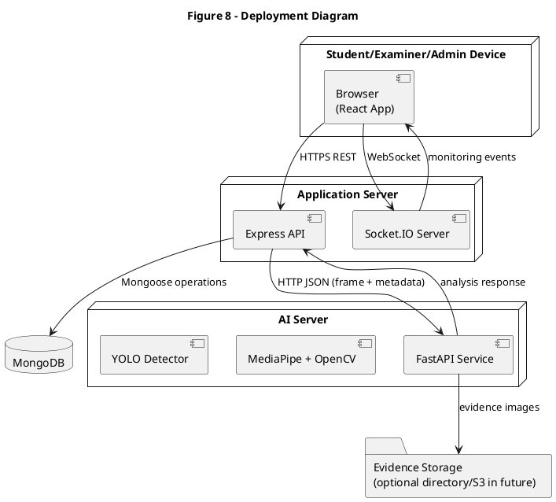

## B.2 Activity Diagram - Pre-Exam and Calibration

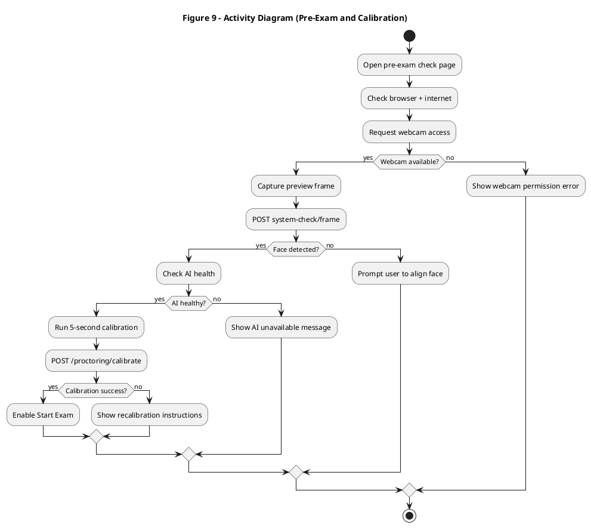

## B.3 State Diagram - Submission Control State

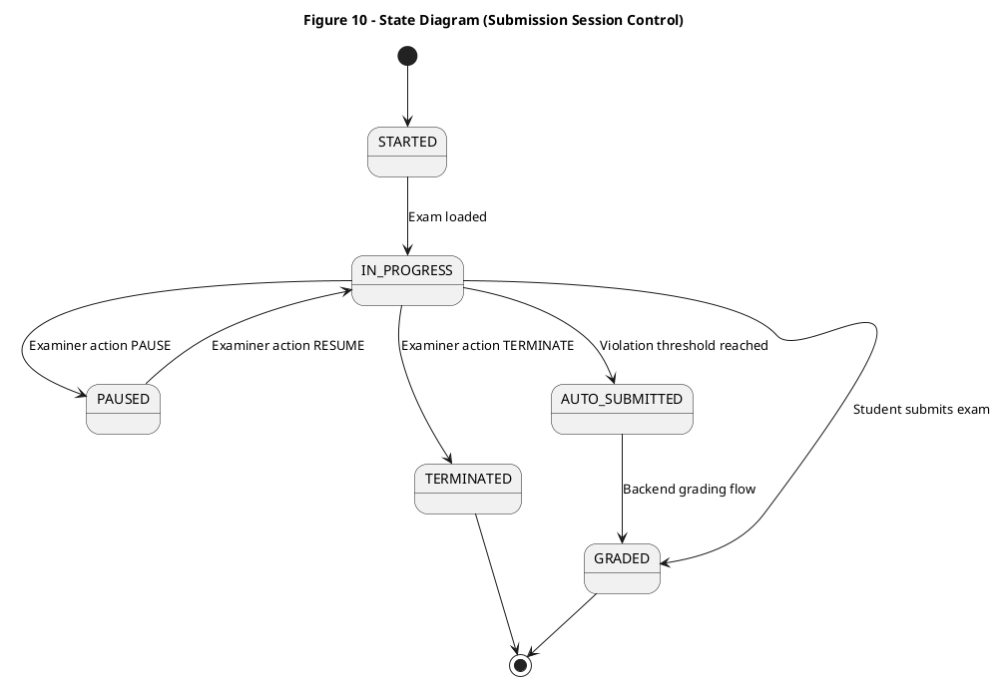

\newpage

# Appendix C: Build and Conversion Steps

## C.1 Generate PlantUML Diagrams

1. Save each PlantUML block to individual `.puml` files under `docs/diagrams/`.
2. Run:

```bash
java -jar plantuml.jar docs/diagrams/*.puml
```

3. Generated images (`.png` or `.svg`) can be inserted in final report document.

## C.2 Convert Markdown to DOCX/PDF

Using Pandoc:

```bash
pandoc AI_PROCTORING/MINI_PROJECT_REPORT.md \
  --toc \
  --number-sections \
  --from markdown \
  --to docx \
  -o AI_PROCTORING/MINI_PROJECT_REPORT.docx
```

For PDF (if LaTeX setup available):

```bash
pandoc AI_PROCTORING/MINI_PROJECT_REPORT.md \
  --toc \
  --number-sections \
  --pdf-engine=xelatex \
  -o AI_PROCTORING/MINI_PROJECT_REPORT.pdf
```

## C.3 Formatting Recommendations for 25+ Pages

To maintain an academic report style and page count:

- Font: Times New Roman, 12 pt
- Line spacing: 1.5
- Margins: 1 inch all sides
- Include generated diagrams and real screenshots
- Keep chapter numbering enabled
- Keep TOC, List of Figures, and List of Tables pages

This markdown intentionally includes detailed explanatory content and diagram source blocks, which generally yields 25+ pages after conversion with above formatting and figures.

\newpage

# Appendix D: Extended Technical Notes

## D.1 Frontend Runtime Behavior (Detailed)

The frontend runtime during an exam is driven by three concerns that must remain balanced:

1. Candidate experience (no disruptive lag, clear warnings, smooth timer behavior).
2. Proctoring quality (frequent enough sampling for meaningful monitoring).
3. Resource control (avoid overloading backend and AI workers).

The implementation in `useProctoring.ts` follows this balance by mixing:

- **Fast tracking frames**: primarily for gaze/head updates.
- **Object detection frames**: sent less frequently for heavier YOLO inference.

The hook does not blindly push frames. It checks:

- Whether the video element is ready.
- Whether a previous request is still in flight.
- Whether enough time has passed for object-mode dispatch.
- Whether queue size would exceed configured bounds.

This design prevents stale frame build-up and supports near real-time overlays where the displayed metrics remain recent rather than delayed by old queued frames.

### D.1.1 Proctoring State Composition

Frontend state merges:

- Server-returned face/gaze/head/suspicion values.
- Prohibited objects array.
- AI service availability status.
- Debug canvas (optional processed image from server).

This state model supports two types of UI:

- Student-facing minimal warnings.
- Engineering/debug overlays during development and threshold tuning.

### D.1.2 Failure Handling and Backoff

The hook treats `429`, `408`, and `5xx` as retriable in non-tracking mode, while tracking frames are dropped more aggressively to keep latency low. This is important because old tracking frames lose value quickly; a delayed frame can mislead the current overlay.

Consecutive send failures trigger:

- increased interval,
- AI availability warning state,
- continued best-effort queue flushing when service recovers.

The user is explicitly informed when AI monitoring is temporarily unavailable, reducing silent failure risk.

## D.2 Backend Processing Logic (Detailed)

The backend route `/api/proctoring/:id/frame` acts as an **integration boundary**:

- Validates auth and route constraints.
- Normalizes input metadata.
- Calls AI service with endpoint-specific timeout/retry policy.
- Decides whether AI violation should be persisted.
- Enriches response for frontend usage.

### D.2.1 Why Node-to-Python Proxy Is Useful

Direct frontend-to-AI calls are simpler but weaker for governance. Current design keeps important control in Node:

- Centralized auth and permission checks.
- Session-aware violation persistence.
- Unified audit trail in submission model.
- Consistent error shaping for frontend.

### D.2.2 Persistence Guardrails

Before writing violation records, backend verifies:

- submission exists,
- exam/session identity matches,
- session is active (`started` or `in-progress`),
- control state is not paused,
- cooldown allows this violation type.

These checks reduce accidental or malicious noisy writes.

### D.2.3 Score and Risk Context in Examiner Layer

Examiner endpoints calculate risk score using weighted severity logic and status factors. This allows dashboards to prioritize high-risk candidates first rather than ordering only by timestamp.

## D.3 AI Service Logic (Detailed)

The AI service uses structured stages in each frame cycle:

1. Decode base64 image.
2. Optional session reset/calibration application.
3. Fast face count pass.
4. Optional object-only branch.
5. Holistic analysis branch.
6. Score update and risk classification.
7. Violation typing + cooldown.
8. Optional debug rendering and response assembly.

### D.3.1 Gaze and Head Stabilization Concepts

Raw gaze and head values are noisy due to:

- webcam quality,
- ambient lighting,
- user movement,
- frame compression artifacts.

To handle this, implementation combines:

- exponential moving averages,
- baseline adaptation when head is near center,
- hysteresis entry/exit thresholds,
- pitch-based suppression for vertical gaze.

This is a practical and explainable approach that improves stability without requiring large training datasets.

### D.3.2 Behavior Score Dynamics

Behavior score dynamics represent a "risk memory":

- sustained abnormality increases score,
- normal behavior decays score,
- severe events (objects, multi-face) force penalty uplift.

This is better than one-frame binary flags because it captures behavioral persistence and reduces false one-off alerts.

## D.4 Data Dictionary

### D.4.1 `Submission` Document Fields

| Field | Type | Purpose |
|---|---|---|
| `studentId` | ObjectId | Student identity link |
| `examId` | ObjectId | Exam identity link |
| `status` | string enum | Exam lifecycle status |
| `controlState` | string enum | Live examiner control state |
| `violations[]` | array | Recorded violation events |
| `violationCount` | number | Total violation counter |
| `isSuspicious` | boolean | Suspicion summary flag |
| `autoSubmitted` | boolean | Auto-submit marker |
| `pauseStartedAt` | Date | Pause start timestamp |
| `totalPausedMs` | number | Total paused duration |
| `lastHeartbeatAt` | Date | Last liveness signal |
| `startedAt` | Date | Session start time |
| `submittedAt` | Date | Session submit time |
| `duration` | number | Effective duration in seconds |

### D.4.2 Violation Event Fields

| Field | Type | Notes |
|---|---|---|
| `type` | enum/string | TAB_SWITCH, COPY_PASTE, NO_FACE, etc. |
| `severity` | enum | MINOR, MEDIUM, CRITICAL |
| `description` | string | Human readable explanation |
| `evidence` | string | base64 image or evidence text |
| `timestamp` | Date | event time |

### D.4.3 Proctoring Response Key Fields

| Field | Type | Description |
|---|---|---|
| `face_count` | number | detected face count |
| `gaze_direction` | string | center/left/right/up/down |
| `head_direction` | string | head orientation label |
| `head_yaw` | number | normalized yaw component |
| `head_pitch` | number | normalized pitch component |
| `gaze_v_ratio` | number | vertical gaze ratio |
| `suspicion_score` | number | 0..100 behavior score |
| `risk_level` | string | LOW/MEDIUM/HIGH |
| `violation_type` | string/null | typed violation |
| `should_log_violation` | boolean | server-side log signal |

## D.5 Sample Payloads

### D.5.1 Frame Request Payload (Node to Python)

```json
{
  "image": "data:image/jpeg;base64,...",
  "session_id": "69917f8...:127.0.0.1",
  "exam_id": "69917f8603290f1a388939b5",
  "objects_only": false,
  "tracking_only": true,
  "include_processed_image": false,
  "calibration": {
    "gaze_h_baseline": 0.51,
    "gaze_v_baseline": 0.49,
    "head_yaw_baseline": 0.01,
    "head_pitch_baseline": 0.02
  }
}
```

### D.5.2 Frame Response Payload (Python to Node/Frontend)

```json
{
  "success": true,
  "face_count": 1,
  "objects": [],
  "suspicion_score": 12,
  "risk_level": "LOW",
  "violation_type": null,
  "should_log_violation": false,
  "gaze_direction": "LOOKING CENTER",
  "head_direction": "HEAD STRAIGHT",
  "head_yaw": 0.03,
  "head_pitch": 0.05,
  "gaze_v_ratio": 0.50
}
```

### D.5.3 Violation Log Payload (Frontend to Backend)

```json
{
  "sessionId": "69917f8...",
  "type": "FULLSCREEN_EXIT",
  "severity": "MEDIUM",
  "description": "Student exited fullscreen mode",
  "evidence": ""
}
```

## D.6 Security Threat Model and Mitigations

### Threat-Mitigations Matrix

| Threat | Impact | Current Mitigation | Residual Risk |
|---|---|---|---|
| Unauthenticated frame spam | AI overload, fake events | Auth on frame route + rate limit | Medium |
| Token theft/reuse | Unauthorized API access | Token blacklist + refresh rotation | Medium |
| Browser bypass attempts | Missed violation capture | Browser event hooks + server-side CV | Medium |
| Replay-like stale frames | Misleading analysis | adaptive send + low queue + timestamps in flow | Medium |
| Excessive 429 conditions | monitoring blind spots | route limit tuning + retries + UI warning | Low/Medium |
| AI service outage | temporary blind monitoring | health checks + availability state | Medium |

### Security Hardening Recommendations

1. Enforce HTTPS in all non-local deployments.
2. Restrict CORS origin list to known frontend hosts in production.
3. Add signed frame nonce/timestamp verification at backend boundary.
4. Move evidence blobs to encrypted object storage.
5. Add centralized audit logs for admin/examiner actions.

## D.7 Performance Tuning Notes

### Practical Tunables

| Parameter | Location | Effect |
|---|---|---|
| `trackingIntervalMs` | frontend hook usage | overlay responsiveness |
| `objectDetectionIntervalMs` | frontend hook usage | object scan frequency |
| `PROCTORING_FRAME_LIMIT_PER_MIN` | backend env | route tolerance |
| `YOLO_IMGSZ` | AI env | detection precision vs speed |
| `STATE_TTL_SECONDS` | AI server | session memory retention |
| `AI_ML_SHADOW_ENABLED` | AI env | shadow inference toggle |

### Tuning Guidance

- Increase object interval before increasing tracking interval if overload appears.
- Keep queue length short for low-latency UX.
- Use route-level metrics (429 counts, RTT, fail rates) to guide limits.
- Tune YOLO image size based on target hardware profile.

\newpage

# Appendix E: User Manuals and Operational Procedures

## E.1 Student User Manual

### Step 1: Login

1. Open the frontend URL.
2. Enter registered email and password.
3. Confirm role-based dashboard redirection.

### Step 2: Pre-Exam Check

1. Allow camera permission when browser prompts.
2. Verify all check cards show success:
   - Webcam ready
   - Face detected
   - Internet stable
   - AI proctoring available
3. Run calibration by keeping head steady and looking at center.
4. Start exam only when calibration succeeds.

### Step 3: During Exam

1. Keep face clearly visible.
2. Avoid leaving fullscreen.
3. Do not switch tabs/windows.
4. Do not copy/paste or use blocked shortcuts.
5. Watch warnings and respond immediately.

### Step 4: Submit Exam

1. Review attempted answers.
2. Submit once done.
3. Confirm submission status message.

## E.2 Examiner User Manual

### Monitor Live Sessions

1. Login with examiner account.
2. Open monitor route for target exam.
3. Review ranked students by risk score.
4. Inspect current violations and latest alert timestamp.
5. Use intervention actions when required:
   - WARN
   - PAUSE
   - RESUME
   - TERMINATE
   - MARK_FALSE_POSITIVE

### Review Integrity Reports

1. Open exam report view.
2. Sort submissions by suspicion indicators.
3. Inspect violation details and evidence snapshots.
4. Record action notes for audit and transparency.

## E.3 Admin User Manual

1. Login as admin.
2. Review dashboard totals:
   - total exams
   - total students
   - active submissions
   - flagged submissions
   - total violations
3. Inspect active exam sessions and recent violations.
4. Use user management tools for suspension workflows.

## E.4 Troubleshooting Guide

### Issue: CORS error in browser on auth/proctoring routes

Checklist:

- Confirm backend server is running on expected host/port.
- Verify frontend origin exists in backend allowed origins.
- Ensure CORS middleware runs before global rate limiters.
- Confirm preflight (`OPTIONS`) is not being blocked.

### Issue: Frequent `429 Too Many Requests` on frame route

Checklist:

- Check `PROCTORING_FRAME_LIMIT_PER_MIN`.
- Increase `objectDetectionIntervalMs` first.
- Keep tracking interval practical for machine/network.
- Verify client queue is not duplicating sends.

### Issue: AI service unavailable warning

Checklist:

- Verify Python server is running (`/health`).
- Confirm backend can reach `PYTHON_SERVICE_URL`.
- Check local firewall or blocked port.
- Inspect backend logs for proxy call failures.

### Issue: Calibration keeps failing

Checklist:

- Keep face centered and well lit.
- Avoid turning head during calibration countdown.
- Remove reflective glare from glasses if possible.
- Re-run calibration with stable webcam positioning.

### Issue: No face detected despite visible user

Checklist:

- Increase ambient lighting.
- Move closer to camera.
- Ensure camera stream has adequate resolution.
- Avoid extreme camera angles.

## E.5 Operational Runbook (Exam Day)

### Pre-Exam (Admin/Examiner)

1. Verify backend and AI health endpoints.
2. Confirm database connectivity.
3. Confirm examiner monitoring page loads.
4. Validate one dry-run student flow end-to-end.

### During Exam

1. Track active session counts.
2. Watch high-risk queue in monitor dashboard.
3. Apply interventions with note text for auditability.
4. Monitor service health every few minutes.

### Post-Exam

1. Export and archive integrity reports.
2. Review flagged cases and evidence.
3. Mark false positives where applicable.
4. Summarize exam integrity metrics for faculty record.

\newpage

# Appendix F: Validation Narrative and Quality Checklist

## F.1 Validation Philosophy

Validation in this project is not limited to "API returns 200". It focuses on:

- consistency across UI, backend, and AI layers,
- practical behavior under load and intermittent connectivity,
- explainability of decisions in examiner review contexts.

## F.2 Layered Validation Checklist

### Frontend Checklist

- Route guards correctly enforce role isolation.
- Token attach logic works in protected endpoints.
- Proctoring overlay updates without visible lag under normal conditions.
- Warning messages are meaningful and not duplicated aggressively.
- Exam timer and question navigation remain responsive when proctoring active.

### Backend Checklist

- Unauthorized frame submissions are blocked.
- Frame route rate limit is enforced but practical.
- Violation persistence only in active sessions.
- Auto-submit criteria output is consistent with violation count.
- Examiner intervention endpoints enforce ownership/role constraints.

### AI Service Checklist

- `/health` reflects actual model loading state.
- `/system_check` returns reliable face count signal.
- `/calibrate` rejects invalid baseline captures with instructions.
- `/process_frame` returns complete key metrics.
- Session TTL cleanup avoids stale growth.

## F.3 Edge-Case Scenarios

### Scenario 1: Student minimizes browser repeatedly

Expected:

- Browser security events logged.
- Violation count increments according to cooldown policy.
- Warnings appear and final submission can be auto-flagged.

### Scenario 2: Temporary AI downtime mid-exam

Expected:

- Frontend shows AI temporarily unavailable banner.
- Exam interface remains usable.
- Proctoring resumes once service recovers.

### Scenario 3: Two users in camera frame

Expected:

- Multi-face event classified as critical.
- Violation persistence attempt made by backend.
- Examiner monitor reflects elevated risk quickly.

### Scenario 4: High-latency connection

Expected:

- Adaptive pacing increases interval.
- Queue remains bounded.
- UI avoids long stale metric tails.

### Scenario 5: Examiner pauses then resumes candidate session

Expected:

- `controlState` transitions `ACTIVE -> PAUSED -> ACTIVE`.
- Pause duration contributes to `totalPausedMs`.
- Effective exam duration excludes pause windows.

## F.4 Quality Metrics to Track in Pilot

Recommended metrics:

1. Average frame round-trip time.
2. Frame send failure rate and 429 frequency.
3. Percentage of sessions with AI availability warnings.
4. Violation distribution by type and severity.
5. False positive marks by examiner.
6. Percentage of auto-submitted sessions.
7. Average examiner review time per flagged session.

## F.5 Acceptance Criteria for Institutional Pilot

Suggested acceptance gates:

- Authentication and exam start success rate >= 99%.
- Proctoring frame pipeline availability >= 98% during exam window.
- No critical security route left unauthenticated.
- Examiner can review all flagged submissions with traceable violations.
- Admin dashboards show consistent aggregate counts.

\newpage

# Appendix G: Ethics, Privacy, and Governance Notes

## G.1 Privacy Principles

The system should operate under:

1. Data minimization.
2. Purpose limitation (exam integrity only).
3. Controlled retention periods.
4. Role-based access.
5. Transparent candidate communication.

## G.2 Candidate Communication Requirements

Before exam start, institutions should clearly communicate:

- what is monitored,
- what triggers violations,
- how evidence is retained,
- who can view records,
- appeal/review procedure.

## G.3 Bias and Fairness Considerations

Potential fairness concerns:

- Lighting and camera quality differences.
- Accessibility cases affecting gaze/head movement.
- Network inequality causing monitoring interruptions.

Mitigation strategies:

- calibration before exam,
- conservative thresholds,
- examiner review and false-positive correction,
- accessibility-aware policy exceptions.

## G.4 Governance Recommendations

1. Keep versioned policy documents for proctoring rules.
2. Maintain audit trail for examiner/admin interventions.
3. Periodically review false-positive rates.
4. Define retention and deletion schedule for evidence.
5. Conduct semester-level postmortem on integrity outcomes.

\newpage

# References

1. Bradski, G. (2000). The OpenCV Library. Dr. Dobb's Journal.
2. King, D. E. (2009). Dlib-ml: A Machine Learning Toolkit. Journal of Machine Learning Research.
3. Kazemi, V., and Sullivan, J. (2014). One millisecond face alignment with an ensemble of regression trees. CVPR.
4. FastAPI Documentation. https://fastapi.tiangolo.com/
5. MediaPipe Documentation. https://ai.google.dev/edge/mediapipe
6. Ultralytics YOLO Documentation. https://docs.ultralytics.com/
7. Express.js Documentation. https://expressjs.com/
8. Mongoose Documentation. https://mongoosejs.com/
9. React Documentation. https://react.dev/
10. Socket.IO Documentation. https://socket.io/
11. Pandoc User Guide. https://pandoc.org/
12. PlantUML Documentation. https://plantuml.com/
13. MongoDB Manual. https://www.mongodb.com/docs/
14. OWASP Cheat Sheet Series (Authentication and Session Management). https://cheatsheetseries.owasp.org/
